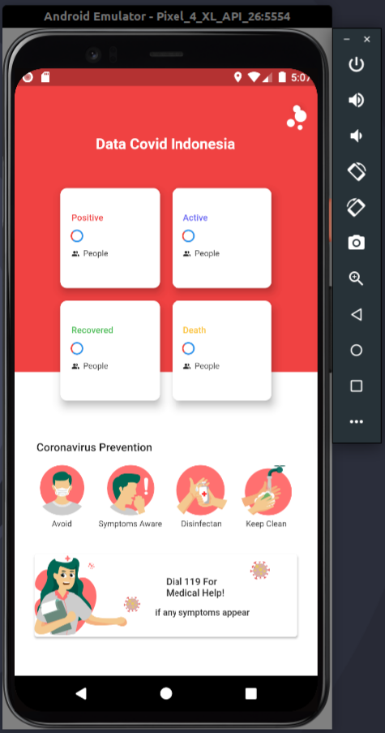
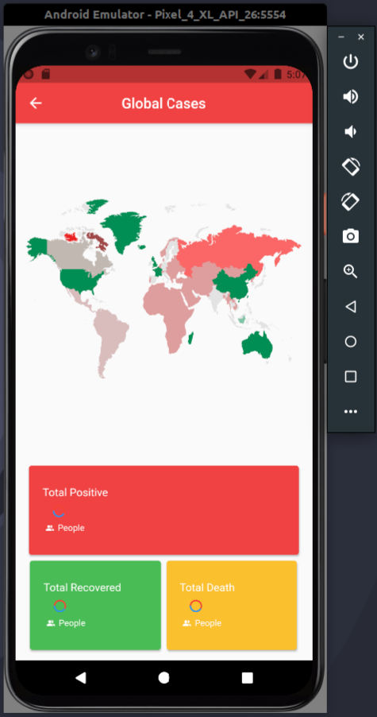

## Mobile dashboar coronavirus data indonesia

Dibuat Dengam : 
- Flutter Version : `Flutter 2.2.3 • channel stable` Null Safety
- SDK Version : `sdk: ">=2.12.0 <3.0.0"`
- Editor : Visual Studio Code
## Halaman Dashboard
- UI HashData & HasError from internet

     

- UI Has Error (Network Connection Time Out)

     

## Happy Coding &#x1F4AA; 