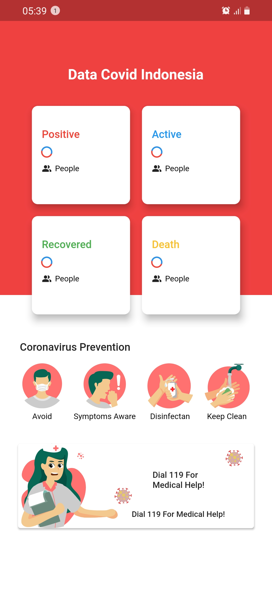

## Mobile dashboar coronavirus data indonesia
[](https://opensource.org/licenses/BSD-2-Clause)

Dibuat Dengam : 
- Flutter Version : `Flutter 2.2.3 • channel stable` Null Safety
- VS Code
## Halaman Dashboard
UI HashData & HasError from internet

 
## API Spec

GET Data Indonesia :
- Method : GET
- Endpoint : `https://api.kawalcorona.com/indonesia`
- Response :
    ```json
    [
        {
            "name" : "String",
            "positif" : "String",
            "sembuh" : "String",
            "meninggal" : "Stringr",
            "dirawat" : "String"
        }
    ]
GET Data Global Positif :
- Method : GET
- Endpoint : `https://api.kawalcorona.com/positif`
- Response :
    ```json
    {
        "name": "Total Positif",
        "value": "201,755,323"
    }
    ```
GET Data Global Sembuh :
- Method : GET
- Endpoint : `https://api.kawalcorona.com/sembuh`
- Response :
    ```json
    {
        "name": "Total Sembuh",
        "value": "0"
        }
    ```
GET Data Global Meninggal :
- Method : GET
- Endpoint : `https://api.kawalcorona.com/meninggal`
- Response :
    ```json
    {
        "name": "Total Meninggal",
        "value": "4,278,398"
    }
    ```

## Happy Coding &#x1F4AA; 

<!-- Require -->

TODO : Add splash screen
TODO : Add Global casus