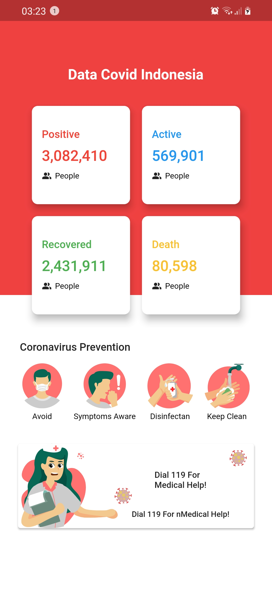

## Mobile dashboar coronavirus data indonesia
[](https://opensource.org/licenses/BSD-2-Clause)

Dibuat Dengam : 
- Flutter Version : `Flutter 2.2.3 • channel stable` Null Safety
- VS Code
## Halaman Dashboard


## API Spec

GET Data Indonesia :
- Method : GET
- Endpoint : `https://api.kawalcorona.com/indonesia`
- Response :
    ```json
    [
        {
            "name" : "String",
            "positif" : "String",
            "sembuh" : "String",
            "meninggal" : "Stringr",
            "dirawat" : "String"
        }
    ]

## Happy Coding &#x1F4AA; 